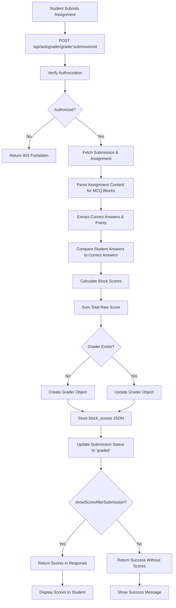
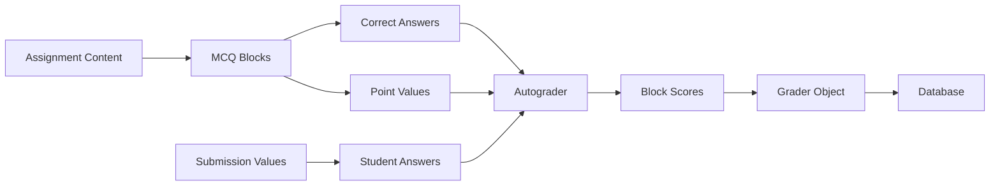

# Design Document

## Overview

This feature implements an automatic grading system for assignments containing MCQ (Multiple Choice Question) blocks. The system will:

1. **Parse assignment content** to extract MCQ blocks with their correct answers and point values
2. **Compare student answers** to correct answers and calculate scores per block
3. **Store detailed scoring** in a new `block_scores` JSONB field in the graders table
4. **Provide an autograding endpoint** that can be called after submission
5. **Control score visibility** based on assignment settings
6. **Enforce authorization** so students can only autograde their own submissions

The design ensures backward compatibility with existing grading workflows while adding automated scoring capabilities.

## Architecture

### Autograding Flow



### Data Flow



## Components and Interfaces

### Backend Components

#### 1. Autograder Route (`classla-backend/src/routes/autograder.ts`)

New route file that handles autograding logic.

**Endpoint:** `POST /api/autograder/grade/:submissionId`

**Request Parameters:**

- `submissionId` (path parameter): UUID of the submission to grade

**Response (with visibility enabled):**

```typescript
interface AutogradeResponse {
  success: boolean;
  grader: {
    id: string;
    submission_id: string;
    raw_assignment_score: number;
    block_scores: {
      [blockId: string]: {
        awarded: number;
        possible: number;
      };
    };
    feedback: string;
    score_modifier: string;
    reviewed_at: Date | null;
  };
  totalPossiblePoints: number;
}
```

**Response (with visibility disabled):**

```typescript
interface AutogradeResponse {
  success: boolean;
  message: string;
}
```

**Authorization Logic:**

```typescript
async function canAutogradeSubmission(
  userId: string,
  submission: Submission,
  isAdmin: boolean
): Promise<{ canAutograde: boolean; message?: string }> {
  // Admins can autograde anything
  if (isAdmin) {
    return { canAutograde: true };
  }

  // Students can only autograde their own submissions
  if (submission.student_id === userId) {
    return { canAutograde: true };
  }

  // Check if user has grading permissions in the course
  const permissions = await getCoursePermissions(userId, submission.course_id);

  if (permissions.canGrade || permissions.canManage) {
    return { canAutograde: true };
  }

  return {
    canAutograde: false,
    message: "Not authorized to autograde this submission",
  };
}
```

**Core Autograding Function:**

```typescript
async function autogradeSubmission(submissionId: string) {
  // 1. Fetch submission
  const submission = await getSubmission(submissionId);
  if (!submission) {
    throw new Error("Submission not found");
  }

  // 2. Fetch assignment
  const assignment = await getAssignment(submission.assignment_id);
  if (!assignment) {
    throw new Error("Assignment not found");
  }

  // 3. Parse assignment content to extract MCQ blocks
  const mcqBlocks = extractMCQBlocks(assignment.content);

  // 4. Calculate scores for each block
  const blockScores: Record<string, { awarded: number; possible: number }> = {};
  let totalRawScore = 0;

  for (const block of mcqBlocks) {
    const studentAnswer = submission.values[block.id];
    const score = calculateBlockScore(block, studentAnswer);

    blockScores[block.id] = {
      awarded: score,
      possible: block.points,
    };

    totalRawScore += score;
  }

  // 5. Create or update grader object
  let grader = await getGrader({ submission_id: submissionId });

  if (!grader) {
    grader = await createGrader({
      submission_id: submissionId,
      raw_assignment_score: totalRawScore,
      raw_rubric_score: 0,
      score_modifier: "",
      feedback: "",
      block_scores: blockScores,
      reviewed_at: null,
    });
  } else {
    grader = await updateGrader(grader.id, {
      raw_assignment_score: totalRawScore,
      block_scores: blockScores,
    });
  }

  // 6. Update submission status to graded
  await updateSubmission(submissionId, {
    status: "graded",
    grader_id: grader.id,
  });

  return { grader, totalPossiblePoints: calculateTotalPoints(mcqBlocks) };
}
```

**MCQ Block Extraction:**

```typescript
interface MCQBlock {
  id: string;
  question: string;
  options: Array<{
    id: string;
    text: string;
    isCorrect: boolean;
  }>;
  allowMultiple: boolean;
  points: number;
  explanation?: string;
}

function extractMCQBlocks(assignmentContent: string): MCQBlock[] {
  try {
    const content = JSON.parse(assignmentContent);
    const mcqBlocks: MCQBlock[] = [];

    // Recursively traverse the TipTap document structure
    function traverse(node: any) {
      if (node.type === "mcqBlock" && node.attrs?.mcqData) {
        const mcqData = node.attrs.mcqData;

        // Validate MCQ data structure
        if (
          mcqData.id &&
          Array.isArray(mcqData.options) &&
          typeof mcqData.points === "number"
        ) {
          mcqBlocks.push(mcqData);
        } else {
          console.warn(`Invalid MCQ block data for block ${mcqData.id}`);
        }
      }

      // Recursively process child nodes
      if (node.content && Array.isArray(node.content)) {
        node.content.forEach(traverse);
      }
    }

    traverse(content);
    return mcqBlocks;
  } catch (error) {
    console.error("Failed to parse assignment content:", error);
    return [];
  }
}
```

**Score Calculation:**

```typescript
function calculateBlockScore(
  block: MCQBlock,
  studentAnswer: string[] | undefined
): number {
  // No answer provided
  if (!studentAnswer || !Array.isArray(studentAnswer)) {
    return 0;
  }

  // Get correct answer IDs
  const correctAnswerIds = block.options
    .filter((option) => option.isCorrect)
    .map((option) => option.id);

  // No correct answers defined
  if (correctAnswerIds.length === 0) {
    return 0;
  }

  // Sort arrays for comparison
  const sortedStudentAnswer = [...studentAnswer].sort();
  const sortedCorrectAnswers = [...correctAnswerIds].sort();

  // Check if arrays are equal (all correct answers selected, no incorrect ones)
  const isCorrect =
    sortedStudentAnswer.length === sortedCorrectAnswers.length &&
    sortedStudentAnswer.every(
      (answer, index) => answer === sortedCorrectAnswers[index]
    );

  return isCorrect ? block.points : 0;
}
```

**Total Points Calculation:**

```typescript
function calculateTotalPoints(mcqBlocks: MCQBlock[]): number {
  return mcqBlocks.reduce((total, block) => total + block.points, 0);
}
```

#### 2. Database Migration

**File:** `classla-backend/migrations/010_add_block_scores_to_graders.sql`

```sql
-- Add block_scores column to graders table
ALTER TABLE graders
ADD COLUMN block_scores JSONB;

-- Add comment explaining the structure
COMMENT ON COLUMN graders.block_scores IS 'JSON object storing per-block scores: { [blockId]: { awarded: number, possible: number } }';

-- Create index for querying block scores (optional, for future analytics)
CREATE INDEX idx_graders_block_scores ON graders USING GIN (block_scores);
```

**Rollback:**

```sql
-- Remove index
DROP INDEX IF EXISTS idx_graders_block_scores;

-- Remove column
ALTER TABLE graders
DROP COLUMN IF EXISTS block_scores;
```

#### 3. Updated Data Models

**File:** `data_models.ts`

```typescript
// Updated Grader interface
interface Grader {
  id: string;
  feedback: string;
  rubric_id?: string;
  raw_assignment_score: number;
  raw_rubric_score: number;
  score_modifier: string;
  reviewed_at?: Date;
  submission_id: string;
  block_scores?: Record<string, { awarded: number; possible: number }>; // NEW
}

// Updated AssignmentSettings interface
interface AssignmentSettings {
  allowLateSubmissions?: boolean;
  allowResubmissions?: boolean;
  showResponsesAfterSubmission?: boolean;
  showScoreAfterSubmission?: boolean; // NEW
  [key: string]: any;
}
```

#### 4. Integration with Submission Flow

Update the submission submit endpoint to trigger autograding:

**File:** `classla-backend/src/routes/submissions.ts`

```typescript
router.post(
  "/submission/:id/submit",
  authenticateToken,
  async (req: Request, res: Response): Promise<void> => {
    try {
      // ... existing submission logic ...

      // Update submission status to submitted
      const { data: updatedSubmission, error: updateError } = await supabase
        .from("submissions")
        .update({
          status: SubmissionStatus.SUBMITTED,
          timestamp: new Date(),
        })
        .eq("id", id)
        .select()
        .single();

      if (updateError) {
        throw updateError;
      }

      // Trigger autograding asynchronously
      // Don't block the response on autograding completion
      autogradeSubmission(id).catch((error) => {
        console.error("Autograding failed:", error);
        // Log error but don't fail the submission
      });

      res.json(updatedSubmission);
    } catch (error) {
      // ... error handling ...
    }
  }
);
```

### Frontend Components

#### 1. Assignment Header Points Display

Update the assignment header to calculate and display total points from MCQ blocks.

**Component:** `AssignmentEditor.tsx` or `AssignmentViewer.tsx`

```typescript
function calculateAssignmentPoints(content: string): number {
  try {
    const parsedContent = JSON.parse(content);
    let totalPoints = 0;

    function traverse(node: any) {
      if (node.type === "mcqBlock" && node.attrs?.mcqData) {
        const points = node.attrs.mcqData.points || 0;
        totalPoints += points;
      }

      if (node.content && Array.isArray(node.content)) {
        node.content.forEach(traverse);
      }
    }

    traverse(parsedContent);
    return totalPoints;
  } catch (error) {
    console.error("Failed to calculate assignment points:", error);
    return 0;
  }
}

// In the component
const totalPoints = useMemo(
  () => calculateAssignmentPoints(assignment.content),
  [assignment.content]
);

// Display in header
<div className="assignment-header">
  <h1>{assignment.name}</h1>
  <div className="points-display">Total Points: {totalPoints}</div>
</div>;
```

#### 2. Assignment Settings Panel

Add the `showScoreAfterSubmission` setting to the assignment settings UI.

**Component:** `AssignmentSettingsPanel.tsx`

```typescript
<div className="setting-item">
  <label>
    <input
      type="checkbox"
      checked={settings.showScoreAfterSubmission ?? false}
      onChange={(e) =>
        onSettingsChange({
          ...settings,
          showScoreAfterSubmission: e.target.checked,
        })
      }
    />
    Show score to students after submission
  </label>
  <p className="setting-description">
    When enabled, students will see their autograded score immediately after
    submitting. When disabled, scores are hidden until you manually release
    them.
  </p>
</div>
```

#### 3. Student Submission View

Update the student view to call the autograding endpoint and display results.

**Component:** `StudentSubmissionView.tsx`

```typescript
const handleSubmit = async () => {
  try {
    // Submit the assignment
    await submitSubmission(submissionId);

    // Call autograding endpoint
    const autogradeResponse = await apiClient.autogradeSubmission(submissionId);

    if (autogradeResponse.data.grader) {
      // Score visibility is enabled, show the score
      toast({
        title: "Assignment Submitted & Graded",
        description: `Your score: ${autogradeResponse.data.grader.raw_assignment_score} / ${autogradeResponse.data.totalPossiblePoints}`,
      });
    } else {
      // Score visibility is disabled
      toast({
        title: "Assignment Submitted",
        description: "Your assignment has been submitted successfully.",
      });
    }
  } catch (error) {
    toast({
      title: "Error",
      description: "Failed to submit assignment. Please try again.",
      variant: "destructive",
    });
  }
};
```

#### 4. Grading View Updates

Update the grading interface to display block-level scores.

**Component:** `GradingControls.tsx`

```typescript
{
  grader?.block_scores && (
    <div className="block-scores-section">
      <h3>Question Scores</h3>
      <div className="block-scores-list">
        {Object.entries(grader.block_scores).map(([blockId, score]) => (
          <div key={blockId} className="block-score-item">
            <span className="block-id">Question {blockId.slice(0, 8)}...</span>
            <span className="block-score">
              {score.awarded} / {score.possible} points
            </span>
          </div>
        ))}
      </div>
      <div className="total-score">
        <strong>Total Raw Score:</strong> {grader.raw_assignment_score}
      </div>
    </div>
  );
}
```

#### 5. API Client Updates

**File:** `classla-frontend/src/lib/api.ts`

```typescript
class ApiClient {
  // ... existing methods

  async autogradeSubmission(submissionId: string) {
    return this.post(`/autograder/grade/${submissionId}`);
  }
}
```

## Data Models

### Updated Grader Table Schema

```sql
CREATE TABLE graders (
  id UUID PRIMARY KEY DEFAULT uuid_generate_v4(),
  submission_id UUID NOT NULL REFERENCES submissions(id) ON DELETE CASCADE,
  feedback TEXT DEFAULT '',
  rubric_id UUID REFERENCES rubric_schemas(id) ON DELETE SET NULL,
  raw_assignment_score NUMERIC DEFAULT 0,
  raw_rubric_score NUMERIC DEFAULT 0,
  score_modifier TEXT DEFAULT '',
  reviewed_at TIMESTAMP,
  block_scores JSONB, -- NEW COLUMN
  created_at TIMESTAMP DEFAULT NOW(),
  updated_at TIMESTAMP DEFAULT NOW()
);
```

### Block Scores JSON Structure

```typescript
{
  "550e8400-e29b-41d4-a716-446655440000": {
    "awarded": 5,
    "possible": 5
  },
  "6ba7b810-9dad-11d1-80b4-00c04fd430c8": {
    "awarded": 0,
    "possible": 3
  },
  "7c9e6679-7425-40de-944b-e07fc1f90ae7": {
    "awarded": 2,
    "possible": 2
  }
}
```

## Error Handling

### Backend Error Scenarios

1. **Submission Not Found:**

   - Return 404 with error code `SUBMISSION_NOT_FOUND`

2. **Assignment Not Found:**

   - Return 404 with error code `ASSIGNMENT_NOT_FOUND`

3. **Authorization Failed:**

   - Return 403 with error code `ACCESS_DENIED`

4. **Invalid Assignment Content:**

   - Log warning, return empty MCQ blocks array
   - Create grader with 0 points

5. **Database Transaction Failed:**

   - Rollback all changes
   - Return 500 with error code `INTERNAL_SERVER_ERROR`

6. **Malformed MCQ Data:**
   - Skip invalid blocks
   - Log warning with block ID
   - Continue processing valid blocks

### Frontend Error Scenarios

1. **Autograding API Call Fails:**

   - Show error toast
   - Submission still marked as submitted
   - Allow manual retry

2. **Network Error:**

   - Show retry button
   - Cache submission locally if possible

3. **Invalid Response:**
   - Log error
   - Show generic error message

## Testing Strategy

### Backend Tests

1. **Autograding Endpoint Tests:**

   - Test successful autograding with correct answers
   - Test autograding with incorrect answers
   - Test autograding with partial answers
   - Test autograding with no answers
   - Test authorization for students (own submissions only)
   - Test authorization for instructors (any submission)
   - Test with missing submission
   - Test with missing assignment
   - Test with malformed assignment content

2. **Score Calculation Tests:**

   - Test single correct answer MCQ
   - Test multiple correct answers MCQ
   - Test no correct answers defined
   - Test empty student answer
   - Test partial correct answers (should be 0)

3. **Block Extraction Tests:**
   - Test extracting MCQ blocks from valid content
   - Test handling malformed JSON
   - Test handling missing MCQ data
   - Test nested content structures

### Frontend Tests

1. **Assignment Header Tests:**

   - Test points calculation with multiple MCQs
   - Test points calculation with no MCQs
   - Test points update when MCQ added/removed

2. **Settings Panel Tests:**

   - Test toggling showScoreAfterSubmission
   - Test saving settings

3. **Submission Flow Tests:**
   - Test submit with score visibility enabled
   - Test submit with score visibility disabled
   - Test autograding error handling

### Integration Tests

1. **End-to-End Autograding:**

   - Create assignment with MCQs
   - Student submits answers
   - Verify autograding triggered
   - Verify scores calculated correctly
   - Verify grader object created
   - Verify submission status updated

2. **Authorization Flow:**
   - Student autogrades own submission (success)
   - Student attempts to autograde another's submission (fail)
   - Instructor autogrades any submission (success)

## Performance Considerations

### Backend Optimization

1. **Async Autograding:**

   - Trigger autograding asynchronously after submission
   - Don't block submission response on autograding completion

2. **Caching:**

   - Cache parsed assignment content for repeated autograding
   - Cache MCQ block extraction results

3. **Database Indexes:**
   - Add GIN index on `block_scores` for future analytics queries
   - Existing indexes on `submission_id` sufficient for lookups

### Frontend Optimization

1. **Points Calculation:**

   - Memoize points calculation to avoid re-parsing on every render
   - Only recalculate when assignment content changes

2. **API Calls:**
   - Use React Query for caching autograding results
   - Implement retry logic with exponential backoff

## Security Considerations

1. **Authorization:**

   - Verify user can access submission before autograding
   - Students can only autograde their own submissions
   - Instructors/TAs can autograde any submission in their course

2. **Input Validation:**

   - Validate submission ID format
   - Validate assignment content structure
   - Sanitize MCQ data before processing

3. **Data Privacy:**

   - Don't expose correct answers in student-facing responses
   - Only return scores if visibility setting allows
   - Instructors always see full scoring details

4. **Rate Limiting:**
   - Consider rate limiting autograding endpoint to prevent abuse
   - Implement per-user rate limits

## Migration and Rollout

### Phase 1: Database Migration (Day 1)

- Run migration to add `block_scores` column
- Verify migration on staging
- Deploy to production

### Phase 2: Backend Implementation (Days 2-3)

- Implement autograder route
- Implement score calculation logic
- Write backend tests
- Deploy to staging

### Phase 3: Frontend Updates (Days 4-5)

- Add assignment settings UI
- Update assignment header
- Update submission flow
- Write frontend tests
- Deploy to staging

### Phase 4: Integration Testing (Day 6)

- End-to-end testing
- Authorization testing
- Performance testing
- Bug fixes

### Phase 5: Production Deployment (Day 7)

- Deploy to production
- Monitor for errors
- Gather user feedback

## Future Enhancements

1. **Partial Credit:**

   - Award partial points for partially correct answers
   - Configurable scoring rules per MCQ

2. **Question Bank Integration:**

   - Link block scores to question bank items
   - Analytics on question difficulty

3. **Regrading:**

   - Bulk regrade all submissions when correct answers change
   - Notify students of grade changes

4. **Advanced Analytics:**

   - Question-level performance metrics
   - Identify difficult questions
   - Student performance trends

5. **Export Capabilities:**

   - Export block-level scores to CSV
   - Detailed grading reports

6. **Manual Score Override:**
   - Allow instructors to override individual block scores
   - Track manual adjustments separately
