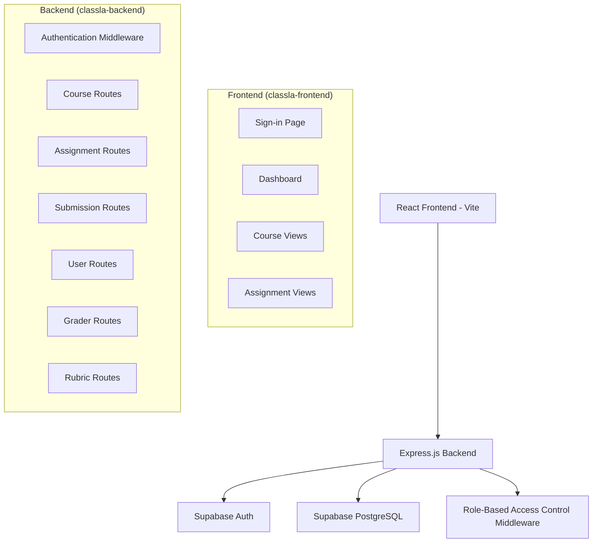

# Design Document

## Overview

Classla LMS is designed as a modern, scalable learning management system with a clear separation between frontend and backend concerns. The architecture follows a client-server model with a React/Vite frontend communicating with an Express.js backend that integrates with Supabase for authentication and PostgreSQL database operations.

## Architecture

### High-Level Architecture



### Technology Stack

**Frontend:**

- React 18 with TypeScript
- Vite for build tooling and development server
- React Router for client-side routing
- Axios for HTTP requests
- Modern CSS or styled-components for styling

**Backend:**

- Node.js with Express.js framework
- TypeScript for type safety
- Supabase client for database operations and authentication
- Express middleware for CORS, JSON parsing, and authentication
- Modular route structure for maintainability

**Database:**

- Supabase PostgreSQL (no RLS needed since access is only through backend API)
- UUID primary keys for all entities
- JSONB columns for flexible settings and content storage

## Components and Interfaces

### Frontend Components

#### Authentication Flow

- **SignInPage**: Handles user authentication via Supabase Auth
- **AuthProvider**: React context for managing authentication state
- **ProtectedRoute**: Higher-order component for route protection

#### Core UI Components

- **Dashboard**: Simple landing page after authentication
- **UserSettings**: Basic user profile and settings management
- **Layout**: Minimal application layout
- **ErrorBoundary**: Error handling and display component

### Backend API Structure

#### Middleware Stack

1. **CORS Middleware**: Enable cross-origin requests from frontend
2. **JSON Parser**: Parse incoming JSON requests
3. **Authentication Middleware**: Verify Supabase JWT tokens
4. **Role Authorization Middleware**: Check user permissions per route

#### Route Modules

**Course Routes (`/api/courses`)**

- `GET /course/by-slug/:slug` - Retrieve course by slug
- `GET /course/:id` - Get course by ID
- `GET /courses?ids=1,2,3` - Batch retrieve by IDs
- `GET /courses/by-slug?slugs=slug1,slug2` - Batch retrieve by slugs
- `POST /course` - Create new course (instructor/admin only)
- `PUT /course/:id` - Update course (instructor/admin only)
- `DELETE /course/:id` - Soft delete course (instructor/admin only)

**Section Routes (`/api/sections`)**

- `GET /sections/by-course/:courseId` - Get sections by course
- `GET /section/by-slug/:slug` - Get section by slug
- `GET /section/:id` - Get section by ID
- `POST /section` - Create section (instructor/admin only)
- `PUT /section/:id` - Update section (instructor/admin only)
- `DELETE /section/:id` - Delete section (instructor/admin only)

**User Routes (`/api/users`)**

- `GET /users/:userId/courses` - Get user's enrolled courses
- `GET /user/:id` - Get user by ID
- `GET /user/role/:courseId` - Get user's role in specific course
- `PUT /user/:id` - Update user profile
- `POST /user/enroll` - Enroll user in course

**Assignment Routes (`/api/assignments`)**

- `GET /assignment/:id/student` - Get assignment (student view, filtered content)
- `GET /assignment/:id` - Get assignment (instructor view, full content)
- `POST /assignment` - Create assignment (instructor/admin only)
- `PUT /assignment/:id` - Update assignment (instructor/admin only)
- `DELETE /assignment/:id` - Delete assignment (instructor/admin only)

**Submission Routes (`/api/submissions`)**

- `GET /submission/:id` - Get submission (with privacy checks)
- `GET /submissions/by-assignment/:assignmentId` - Get all submissions for assignment
- `POST /submission` - Create/update submission (student only)
- `PUT /submission/:id/grade` - Grade submission (instructor/TA only)

**Grader Routes (`/api/graders`)**

- `GET /grader/:id` - Get grader feedback (with privacy checks)
- `POST /grader` - Create grader entry (instructor/TA only)
- `PUT /grader/:id` - Update grader feedback (instructor/TA only)

**Rubric Routes (`/api/rubrics`)**

- `GET /rubric-schema/:assignmentId` - Get rubric schema for assignment
- `GET /rubric/:submissionId` - Get rubric scores for submission
- `POST /rubric-schema` - Create rubric schema (instructor only)
- `POST /rubric` - Apply rubric to submission (instructor/TA only)
- `PUT /rubric/:id` - Update rubric scores (instructor/TA only)

## Data Models

### Database Schema (SQL)

```sql
-- Enable UUID extension
CREATE EXTENSION IF NOT EXISTS "uuid-ossp";

-- User roles enum
CREATE TYPE user_role AS ENUM ('instructor', 'admin', 'teaching_assistant', 'student', 'audit');

-- Users table
CREATE TABLE users (
    id UUID PRIMARY KEY DEFAULT uuid_generate_v4(),
    name TEXT,
    is_admin BOOLEAN DEFAULT FALSE,
    roles user_role[] DEFAULT '{}',
    email TEXT UNIQUE NOT NULL,
    settings JSONB DEFAULT '{}',
    created_at TIMESTAMP WITH TIME ZONE DEFAULT NOW(),
    updated_at TIMESTAMP WITH TIME ZONE DEFAULT NOW()
);

-- Courses table
CREATE TABLE courses (
    id UUID PRIMARY KEY DEFAULT uuid_generate_v4(),
    name TEXT NOT NULL,
    settings JSONB DEFAULT '{}',
    thumbnail_url TEXT,
    summary_content TEXT,
    slug TEXT UNIQUE NOT NULL,
    created_by_id UUID REFERENCES users(id),
    created_at TIMESTAMP WITH TIME ZONE DEFAULT NOW(),
    deleted_at TIMESTAMP WITH TIME ZONE
);

-- Sections table
CREATE TABLE sections (
    id UUID PRIMARY KEY DEFAULT uuid_generate_v4(),
    course_id UUID REFERENCES courses(id) ON DELETE CASCADE,
    name TEXT NOT NULL,
    description TEXT,
    slug TEXT NOT NULL,
    created_at TIMESTAMP WITH TIME ZONE DEFAULT NOW(),
    UNIQUE(course_id, slug)
);

-- Assignments table
CREATE TABLE assignments (
    id UUID PRIMARY KEY DEFAULT uuid_generate_v4(),
    name TEXT NOT NULL,
    course_id UUID REFERENCES courses(id) ON DELETE CASCADE,
    settings JSONB DEFAULT '{}',
    content TEXT, -- TipTap editor content
    published_to TEXT[] DEFAULT '{}',
    due_dates_map JSONB DEFAULT '{}',
    module_path TEXT[] DEFAULT '{}',
    is_lockdown BOOLEAN DEFAULT FALSE,
    lockdown_time_map JSONB DEFAULT '{}',
    created_at TIMESTAMP WITH TIME ZONE DEFAULT NOW(),
    updated_at TIMESTAMP WITH TIME ZONE DEFAULT NOW()
);

-- Submissions table
CREATE TABLE submissions (
    id UUID PRIMARY KEY DEFAULT uuid_generate_v4(),
    assignment_id UUID REFERENCES assignments(id) ON DELETE CASCADE,
    timestamp TIMESTAMP WITH TIME ZONE DEFAULT NOW(),
    values JSONB DEFAULT '{}',
    course_id UUID REFERENCES courses(id),
    student_id UUID REFERENCES users(id),
    grader_id UUID REFERENCES users(id),
    grade NUMERIC,
    status TEXT CHECK (status IN ('submitted', 'graded', 'returned', 'in-progress')) DEFAULT 'in-progress',
    created_at TIMESTAMP WITH TIME ZONE DEFAULT NOW(),
    updated_at TIMESTAMP WITH TIME ZONE DEFAULT NOW()
);

-- Graders table
CREATE TABLE graders (
    id UUID PRIMARY KEY DEFAULT uuid_generate_v4(),
    feedback TEXT,
    rubric_id UUID,
    raw_assignment_score NUMERIC NOT NULL,
    raw_rubric_score NUMERIC NOT NULL,
    score_modifier TEXT,
    reviewed_at TIMESTAMP WITH TIME ZONE,
    submission_id UUID REFERENCES submissions(id) ON DELETE CASCADE,
    created_at TIMESTAMP WITH TIME ZONE DEFAULT NOW()
);

-- Rubric schemas table
CREATE TABLE rubric_schemas (
    id UUID PRIMARY KEY DEFAULT uuid_generate_v4(),
    assignment_id UUID REFERENCES assignments(id) ON DELETE CASCADE,
    title TEXT NOT NULL,
    use_for_grading BOOLEAN DEFAULT FALSE,
    items JSONB NOT NULL, -- Array of RubricItem objects
    created_at TIMESTAMP WITH TIME ZONE DEFAULT NOW()
);

-- Rubrics table (instances)
CREATE TABLE rubrics (
    id UUID PRIMARY KEY DEFAULT uuid_generate_v4(),
    submission_id UUID REFERENCES submissions(id) ON DELETE CASCADE,
    rubric_schema_id UUID REFERENCES rubric_schemas(id),
    values NUMERIC[] DEFAULT '{}',
    created_at TIMESTAMP WITH TIME ZONE DEFAULT NOW(),
    updated_at TIMESTAMP WITH TIME ZONE DEFAULT NOW()
);

-- Course enrollments table (many-to-many relationship)
CREATE TABLE course_enrollments (
    id UUID PRIMARY KEY DEFAULT uuid_generate_v4(),
    user_id UUID REFERENCES users(id) ON DELETE CASCADE,
    course_id UUID REFERENCES courses(id) ON DELETE CASCADE,
    role user_role NOT NULL,
    enrolled_at TIMESTAMP WITH TIME ZONE DEFAULT NOW(),
    UNIQUE(user_id, course_id)
);

-- Indexes for performance
CREATE INDEX idx_courses_slug ON courses(slug);
CREATE INDEX idx_courses_created_by ON courses(created_by_id);
CREATE INDEX idx_sections_course ON sections(course_id);
CREATE INDEX idx_assignments_course ON assignments(course_id);
CREATE INDEX idx_submissions_assignment ON submissions(assignment_id);
CREATE INDEX idx_submissions_student ON submissions(student_id);
CREATE INDEX idx_enrollments_user ON course_enrollments(user_id);
CREATE INDEX idx_enrollments_course ON course_enrollments(course_id);
```

### Role-Based Access Control Logic

#### Permission Matrix

- **Admin**: Full system access
- **Instructor**: Full access to owned courses, assignments, and student data
- **Teaching Assistant**: Read/write access to assigned courses, grading permissions
- **Student**: Read access to enrolled courses and assignments, write access to own submissions
- **Audit**: Read-only access to enrolled courses

#### Authorization Middleware Implementation

```typescript
interface AuthContext {
  userId: string;
  userRoles: UserRole[];
  isAdmin: boolean;
}

interface CoursePermissions {
  canRead: boolean;
  canWrite: boolean;
  canGrade: boolean;
  canManage: boolean;
}
```

## Error Handling

### Frontend Error Handling

- Global error boundary for React component errors
- Axios interceptors for API error handling
- User-friendly error messages with fallback options
- Retry mechanisms for transient failures

### Backend Error Handling

- Centralized error handling middleware
- Structured error responses with consistent format
- Logging for debugging and monitoring
- Graceful degradation for non-critical failures

### Error Response Format

```typescript
interface ErrorResponse {
  error: {
    code: string;
    message: string;
    details?: any;
  };
  timestamp: string;
  path: string;
}
```

## Testing Strategy

### Frontend Testing

- **Unit Tests**: Component testing with React Testing Library
- **Integration Tests**: API integration and user flow testing
- **E2E Tests**: Critical user journeys with Playwright or Cypress

### Backend Testing

- **Unit Tests**: Route handlers and middleware with Jest
- **Integration Tests**: Database operations and API endpoints
- **Security Tests**: Authentication and authorization flows

### Database Testing

- **Schema Validation**: Ensure migrations match TypeScript interfaces
- **Performance Tests**: Query optimization and indexing validation
- **Data Integrity Tests**: Foreign key constraints and validation rules

## Security Considerations

### Authentication Security

- Supabase JWT token validation on all protected routes
- Token refresh handling for long-lived sessions
- Secure token storage in frontend (httpOnly cookies or secure localStorage)

### Authorization Security

- Application-level role-based access control in Express middleware
- Server-side permission checks for all data access
- Input validation and sanitization
- SQL injection prevention through parameterized queries

### Data Protection

- Sensitive data encryption at rest
- HTTPS enforcement for all communications
- CORS configuration to prevent unauthorized access
- Rate limiting to prevent abuse

## Performance Optimization

### Frontend Performance

- Code splitting and lazy loading for route components
- Memoization for expensive computations
- Efficient state management to minimize re-renders
- Image optimization and lazy loading

### Backend Performance

- Database query optimization with proper indexing
- Connection pooling for database connections
- Caching strategies for frequently accessed data
- Pagination for large data sets

### Database Performance

- Proper indexing strategy based on query patterns
- Query optimization and EXPLAIN analysis
- Connection pooling and prepared statements
- Regular maintenance and statistics updates
