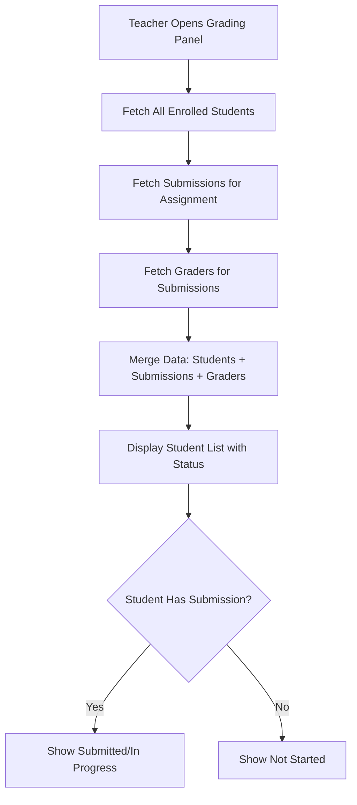
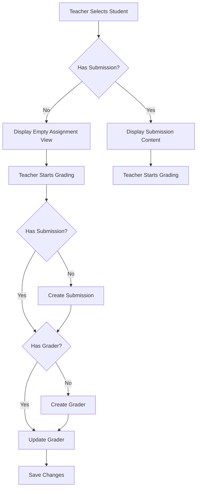

# Design Document

## Overview

This feature enhances the grading system to provide complete visibility of all enrolled students and automatically create necessary database records (grader objects and submissions) when teachers begin grading. The design focuses on three main areas:

1. **Backend API Enhancement** - Modify the submissions endpoint to return all enrolled students regardless of submission status
2. **Auto-Creation Logic** - Implement automatic creation of grader and submission objects when teachers interact with grading controls
3. **Frontend Updates** - Update GradingSidebar, GradingControls, and AssignmentViewer to handle null submissions and display all students

The design maintains backward compatibility with existing grading functionality while adding seamless auto-creation capabilities.

## Architecture

### Data Flow for Displaying All Students



### Data Flow for Auto-Creation



## Components and Interfaces

### Backend Changes

#### 1. Enhanced Submissions Endpoint

**Endpoint:** `GET /api/submissions/by-assignment/:assignmentId/with-students`

**Current Behavior:** Returns only students who have submissions

**New Behavior:** Returns all enrolled students with their submission data (or null if no submission)

**Response Structure:**

```typescript
interface SubmissionWithStudent {
  student: {
    id: string;
    firstName: string;
    lastName: string;
    email: string;
  };
  submission: Submission | null;
  grader: Grader | null;
  sectionId: string | null;
  sectionName: string | null;
}
```

**Implementation Details:**

```typescript
// Pseudo-code for the enhanced endpoint
async function getSubmissionsWithStudents(assignmentId: string) {
  // 1. Get assignment to find course
  const assignment = await getAssignment(assignmentId);

  // 2. Get all enrolled students in the course
  const enrollments = await getEnrollments(assignment.course_id);

  // 3. Get all submissions for this assignment
  const submissions = await getSubmissions({ assignment_id: assignmentId });

  // 4. Get all graders for these submissions
  const graders = await getGraders(submissions.map((s) => s.id));

  // 5. Merge data - create entry for each enrolled student
  const result = enrollments.map((enrollment) => {
    const submission = submissions.find(
      (s) => s.student_id === enrollment.user_id
    );
    const grader = submission
      ? graders.find((g) => g.submission_id === submission.id)
      : null;

    return {
      student: {
        id: enrollment.user_id,
        firstName: enrollment.user.first_name,
        lastName: enrollment.user.last_name,
        email: enrollment.user.email,
      },
      submission: submission || null,
      grader: grader || null,
      sectionId: enrollment.section_id,
      sectionName: enrollment.section?.name || null,
    };
  });

  return result;
}
```

#### 2. New Grader Auto-Creation Endpoint

**Endpoint:** `POST /api/grader/create-with-submission`

**Purpose:** Atomically create both submission and grader objects when needed

**Request Body:**

```typescript
interface CreateGraderWithSubmissionRequest {
  assignmentId: string;
  studentId: string;
  courseId: string;
}
```

**Response:**

```typescript
interface CreateGraderWithSubmissionResponse {
  submission: Submission;
  grader: Grader;
  created: {
    submission: boolean; // true if submission was created
    grader: boolean; // true if grader was created
  };
}
```

**Implementation Logic:**

```typescript
async function createGraderWithSubmission(request) {
  const { assignmentId, studentId, courseId } = request;

  // Start transaction
  const transaction = await db.transaction();

  try {
    let submission;
    let submissionCreated = false;

    // Check if submission exists
    submission = await getSubmission({
      assignment_id: assignmentId,
      student_id: studentId,
    });

    if (!submission) {
      // Create submission with "not-started" status
      submission = await createSubmission({
        assignment_id: assignmentId,
        student_id: studentId,
        course_id: courseId,
        status: "not-started",
        content: {},
        grade: null,
      });
      submissionCreated = true;
    }

    let grader;
    let graderCreated = false;

    // Check if grader exists
    grader = await getGrader({ submission_id: submission.id });

    if (!grader) {
      // Create grader with default values
      grader = await createGrader({
        submission_id: submission.id,
        raw_assignment_score: 0,
        raw_rubric_score: 0,
        score_modifier: "",
        feedback: "",
        reviewed_at: null,
      });
      graderCreated = true;
    }

    await transaction.commit();

    return {
      submission,
      grader,
      created: {
        submission: submissionCreated,
        grader: graderCreated,
      },
    };
  } catch (error) {
    await transaction.rollback();
    throw error;
  }
}
```

### Frontend Changes

#### 1. GradingSidebar Component Updates

**Current Issue:** Only displays students with submissions

**Solution:** Update to display all students from the enhanced API response

**Key Changes:**

- Remove filtering logic that excludes students without submissions
- Add status badge rendering based on submission state
- Handle null submission case when student is selected

**Status Display Logic:**

```typescript
function getSubmissionStatus(submission: Submission | null): {
  label: string;
  color: string;
} {
  if (!submission) {
    return { label: "Not Started", color: "text-red-600" };
  }

  switch (submission.status) {
    case "in-progress":
      return { label: "In Progress", color: "text-yellow-600" };
    case "submitted":
    case "graded":
      return { label: "Submitted", color: "text-green-600" };
    default:
      return { label: "Not Started", color: "text-red-600" };
  }
}
```

**Updated Student List Item:**

```typescript
<button
  key={student.userId}
  onClick={() => onStudentSelect(student)}
  className="w-full p-4 text-left hover:bg-gray-50 transition-colors"
>
  <div className="font-medium text-gray-900">
    {student.lastName}, {student.firstName}
  </div>
  <div className={`text-sm mt-1 ${status.color}`}>
    {status.label}
    {student.grader && ` • ${calculateFinalGrade(student.grader)}`}
  </div>
</button>
```

#### 2. GradingControls Component Updates

**Current Issue:** Assumes grader object exists

**Solution:** Add auto-creation logic before allowing user input

**Key Changes:**

- Add `ensureGraderExists` function that calls the auto-creation endpoint
- Disable inputs while grader is being created
- Show loading state during creation
- Handle creation errors gracefully

**Auto-Creation Hook:**

```typescript
function useEnsureGrader(
  assignmentId: string,
  studentId: string,
  courseId: string,
  existingGrader: Grader | null
) {
  const [isCreating, setIsCreating] = useState(false);
  const [grader, setGrader] = useState<Grader | null>(existingGrader);
  const queryClient = useQueryClient();

  const ensureGrader = useCallback(async () => {
    if (grader) return grader;

    setIsCreating(true);
    try {
      const response = await apiClient.createGraderWithSubmission({
        assignmentId,
        studentId,
        courseId,
      });

      setGrader(response.data.grader);

      // Invalidate queries to refresh data
      queryClient.invalidateQueries(["submissions", "with-students"]);

      return response.data.grader;
    } catch (error) {
      console.error("Failed to create grader:", error);
      throw error;
    } finally {
      setIsCreating(false);
    }
  }, [assignmentId, studentId, courseId, grader, queryClient]);

  return { grader, isCreating, ensureGrader };
}
```

**Updated GradingControls:**

```typescript
export const GradingControls: React.FC<GradingControlsProps> = ({
  grader: initialGrader,
  assignmentId,
  studentId,
  courseId,
  onUpdate,
  autoSave = true,
}) => {
  const { grader, isCreating, ensureGrader } = useEnsureGrader(
    assignmentId,
    studentId,
    courseId,
    initialGrader
  );

  const handleFocus = async () => {
    if (!grader && !isCreating) {
      try {
        await ensureGrader();
      } catch (error) {
        toast({
          title: "Error",
          description: "Failed to initialize grading. Please try again.",
          variant: "destructive",
        });
      }
    }
  };

  return (
    <div className="space-y-6">
      {isCreating && (
        <div className="flex items-center justify-center p-4 bg-purple-50 rounded-md">
          <Loader2 className="h-5 w-5 animate-spin text-purple-600 mr-2" />
          <span className="text-sm text-purple-900">
            Initializing grading...
          </span>
        </div>
      )}

      <Input
        value={scoreModifier}
        onChange={handleScoreModifierChange}
        onFocus={handleFocus}
        disabled={isCreating}
      />

      <Textarea
        value={feedback}
        onChange={handleFeedbackChange}
        onFocus={handleFocus}
        disabled={isCreating}
      />

      {/* ... rest of controls */}
    </div>
  );
};
```

#### 3. AssignmentViewer Component Updates

**Current Issue:** Expects a valid submission object

**Solution:** Handle null submission case gracefully

**Key Changes:**

- Accept `submission: Submission | null` prop
- Display assignment content even when submission is null
- Show empty/default answers when submission is null
- Display "No submission yet" message
- Disable all interactive elements when submission is null

**Null Submission Handling:**

```typescript
export const AssignmentViewer: React.FC<AssignmentViewerProps> = ({
  assignment,
  submission,
  isGrading = false,
}) => {
  // Use empty content if no submission
  const content = submission?.content || {};
  const hasSubmission = !!submission;

  return (
    <div className="assignment-viewer">
      {!hasSubmission && (
        <div className="bg-yellow-50 border border-yellow-200 rounded-md p-4 mb-4">
          <p className="text-sm text-yellow-800">
            This student has not submitted this assignment yet.
          </p>
        </div>
      )}

      <TipTapEditor
        content={assignment.content}
        editable={false}
        answers={content}
        showAnswers={isGrading}
        disabled={!hasSubmission}
      />
    </div>
  );
};
```

#### 4. API Client Updates

**New Methods:**

```typescript
class ApiClient {
  // ... existing methods

  async createGraderWithSubmission(data: CreateGraderWithSubmissionRequest) {
    return this.post("/grader/create-with-submission", data);
  }
}
```

## Data Models

### Existing Models (No Schema Changes)

All existing database schemas remain unchanged:

- `submissions` table
- `graders` table
- `course_enrollments` table
- `users` table
- `sections` table

### Status Determination Logic

**Submission Status:**

```typescript
type SubmissionStatusDisplay = "Not Started" | "In Progress" | "Submitted";

function determineSubmissionStatus(
  submission: Submission | null
): SubmissionStatusDisplay {
  if (!submission) return "Not Started";

  switch (submission.status) {
    case "in-progress":
      return "In Progress";
    case "submitted":
    case "graded":
      return "Submitted";
    default:
      return "Not Started";
  }
}
```

## Error Handling

### Backend Error Scenarios

1. **Student Not Enrolled:**

   - Return 403 Forbidden
   - Message: "Student is not enrolled in this course"

2. **Assignment Not Found:**

   - Return 404 Not Found
   - Message: "Assignment not found"

3. **Transaction Failure:**

   - Rollback all changes
   - Return 500 Internal Server Error
   - Message: "Failed to create grading records"

4. **Duplicate Creation:**
   - Check for existing records before creating
   - Return existing records if found
   - No error thrown

### Frontend Error Scenarios

1. **Grader Creation Fails:**

   - Show toast notification
   - Keep inputs disabled
   - Provide retry button

2. **Auto-Save Fails:**

   - Show error toast
   - Keep local changes
   - Retry on next input change

3. **Data Fetch Fails:**
   - Show error message in sidebar
   - Provide refresh button
   - Log error for debugging

## Testing Strategy

### Backend Tests

1. **Enhanced Submissions Endpoint:**

   - Test returns all enrolled students
   - Test includes students without submissions
   - Test submission and grader data is correctly merged
   - Test section filtering works
   - Test authorization (only graders can access)

2. **Auto-Creation Endpoint:**
   - Test creates submission when missing
   - Test creates grader when missing
   - Test returns existing records when present
   - Test transaction rollback on failure
   - Test authorization
   - Test with invalid student/assignment IDs

### Frontend Tests

1. **GradingSidebar:**

   - Test displays all students
   - Test status badges render correctly
   - Test filtering works with all students
   - Test selecting student without submission

2. **GradingControls:**

   - Test auto-creation on focus
   - Test loading state during creation
   - Test error handling
   - Test disabled state during creation
   - Test normal operation after creation

3. **AssignmentViewer:**
   - Test renders with null submission
   - Test displays "no submission" message
   - Test shows assignment content
   - Test interactive elements are disabled

### Integration Tests

1. **Full Grading Flow:**

   - Teacher opens grading panel
   - Sees all students including non-submitters
   - Selects student without submission
   - Starts typing in grading controls
   - System creates submission and grader
   - Teacher completes grading
   - Changes are saved successfully

2. **Gradebook Integration:**
   - Gradebook shows all students
   - "Not Started" cells are clickable
   - Clicking opens grading panel
   - Auto-creation works from gradebook flow

## Performance Considerations

### Backend Optimization

1. **Query Optimization:**

   - Use JOINs to fetch enrollments, submissions, and graders in minimal queries
   - Add index on `submissions.assignment_id` and `submissions.student_id`
   - Add index on `graders.submission_id`

2. **Caching:**
   - Cache enrollment data (changes infrequently)
   - Use query result caching for gradebook data

### Frontend Optimization

1. **Data Fetching:**

   - Use React Query for caching and deduplication
   - Implement stale-while-revalidate pattern
   - Prefetch student data when grading panel opens

2. **Rendering:**
   - Memoize student list filtering
   - Use React.memo for student list items
   - Virtualize student list for large classes (>100 students)

## Security Considerations

1. **Authorization:**

   - Verify grading permissions on all endpoints
   - Prevent students from creating graders for other students
   - Validate student is enrolled before creating submission

2. **Input Validation:**

   - Validate assignment and student IDs
   - Ensure course ID matches assignment's course
   - Prevent creation of duplicate records

3. **Data Privacy:**
   - Students cannot see other students' submissions
   - Only return student data to authorized graders
   - Audit log grader creation events

## Migration and Rollout

### Phase 1: Backend Changes (Week 1)

- Implement enhanced submissions endpoint
- Implement auto-creation endpoint
- Write backend tests
- Deploy to staging

### Phase 2: Frontend Updates (Week 2)

- Update GradingSidebar to show all students
- Update GradingControls with auto-creation
- Update AssignmentViewer for null submissions
- Write frontend tests
- Deploy to staging

### Phase 3: Integration Testing (Week 3)

- End-to-end testing
- Performance testing with large classes
- Bug fixes
- Deploy to production

### Phase 4: Gradebook Integration (Week 4)

- Update GradebookPage to show all students
- Update GradebookTable cell rendering
- Test gradebook to grading panel flow
- Deploy to production

## Future Enhancements

1. **Bulk Operations:**

   - Create graders for all students at once
   - Bulk status updates

2. **Analytics:**

   - Track which students haven't started
   - Send reminders to non-submitters

3. **Grading Templates:**

   - Save common feedback as templates
   - Apply templates to multiple students

4. **Offline Support:**
   - Queue grader creation when offline
   - Sync when connection restored
