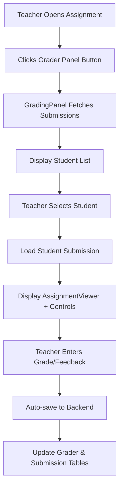

# Design Document

## Overview

The grading and gradebook system provides teachers with efficient tools to grade student submissions and view class performance, while giving students visibility into their grades and progress. The system consists of three main components:

1. **Grading Panel** - An integrated panel within the assignment page for teachers to grade submissions
2. **Teacher Gradebook** - A table view showing all students and their grades across assignments
3. **Student Grades View** - A list view for students to see their own grades and feedback

The design leverages existing components (AssignmentViewer, authorization middleware) and follows the established patterns in the codebase for consistency.

## Architecture

### Component Hierarchy

```
AssignmentPage (existing)
├── GradingPanel (new)
│   ├── StudentList (new)
│   │   ├── SearchBar (new)
│   │   ├── SectionFilter (new)
│   │   └── StudentListItem (new)
│   └── StudentSubmissionView (new)
│       ├── StudentNavigationHeader (new)
│       ├── SubmissionSelector (new)
│       ├── AssignmentViewer (existing - reused)
│       └── GradingControls (new)

GradebookPage (new)
├── GradebookTable (new)
│   ├── GradebookHeader (new)
│   ├── GradebookRow (new)
│   └── GradebookCell (new)
└── SectionFilter (reused)

StudentGradesPage (new)
├── GradesList (new)
│   └── GradeItem (new)
└── GradeDetailModal (new)
```

### Data Flow



## Components and Interfaces

### Frontend Components

#### 1. GradingPanel Component

**Purpose:** Main container for the grading interface, replacing the placeholder in AssignmentPage.

**Props:**

```typescript
interface GradingPanelProps {
  assignment: Assignment;
  courseId: string;
  onClose: () => void;
}
```

**State:**

```typescript
interface GradingPanelState {
  students: StudentSubmissionInfo[];
  filteredStudents: StudentSubmissionInfo[];
  selectedStudentId: string | null;
  searchQuery: string;
  selectedSectionId: string | null;
  isLoading: boolean;
}

interface StudentSubmissionInfo {
  userId: string;
  firstName: string;
  lastName: string;
  sectionId: string | null;
  sectionName: string | null;
  submissions: Submission[];
  latestSubmission: Submission | null;
  grader: Grader | null;
}
```

**Behavior:**

- Fetches all submissions for the assignment on mount
- Fetches student enrollment data to get names and sections
- Fetches grader data for each submission
- Manages filtering and search state
- Handles student selection and navigation

#### 2. StudentList Component

**Purpose:** Displays searchable, filterable list of students with submission status.

**Props:**

```typescript
interface StudentListProps {
  students: StudentSubmissionInfo[];
  selectedStudentId: string | null;
  onStudentSelect: (studentId: string) => void;
  searchQuery: string;
  onSearchChange: (query: string) => void;
  sections: Section[];
  selectedSectionId: string | null;
  onSectionChange: (sectionId: string | null) => void;
}
```

**Features:**

- Search input at top
- Section dropdown filter
- Scrollable list of students
- Each item shows: name, status, grade, reviewed badge
- Sorted by last name alphabetically
- Selected student highlighted

#### 3. StudentSubmissionView Component

**Purpose:** Displays selected student's submission with grading controls.

**Props:**

```typescript
interface StudentSubmissionViewProps {
  student: StudentSubmissionInfo;
  assignment: Assignment;
  onNavigatePrevious: () => void;
  onNavigateNext: () => void;
  hasPrevious: boolean;
  hasNext: boolean;
  onGraderUpdate: (graderId: string, updates: Partial<Grader>) => void;
}
```

**Layout:**

- Navigation header with student name and arrows
- Submission selector (if multiple submissions)
- AssignmentViewer component (reused)
- Grading controls panel below viewer

#### 4. GradingControls Component

**Purpose:** Provides inputs for score modifier, feedback, and reviewed status.

**Props:**

```typescript
interface GradingControlsProps {
  submission: Submission;
  grader: Grader | null;
  onUpdate: (updates: Partial<Grader>) => void;
  autoSave?: boolean;
}
```

**Fields:**

- Autograded Score (read-only display)
- Raw Score (read-only display)
- Score Modifier (number input)
- Final Grade (calculated display)
- Feedback (textarea)
- Reviewed checkbox with timestamp

**Auto-save:**

- Debounced save on input changes (500ms delay)
- Visual indicator when saving
- Error handling with toast notifications

#### 5. GradebookPage Component

**Purpose:** Main page component for teacher gradebook view.

**Route:** `/course/:courseSlug/gradebook`

**State:**

```typescript
interface GradebookState {
  students: StudentGradebookInfo[];
  assignments: Assignment[];
  submissions: Map<string, Submission>; // key: `${studentId}_${assignmentId}`
  graders: Map<string, Grader>; // key: submissionId
  selectedSectionId: string | null;
  isLoading: boolean;
}

interface StudentGradebookInfo {
  userId: string;
  firstName: string;
  lastName: string;
  sectionId: string | null;
}
```

**Features:**

- Fetches all course assignments
- Fetches all student enrollments
- Fetches all submissions for the course
- Renders table with horizontal scroll
- Section filter dropdown
- Click on cell navigates to grading panel

#### 6. GradebookTable Component

**Purpose:** Renders the grade table with students and assignments.

**Props:**

```typescript
interface GradebookTableProps {
  students: StudentGradebookInfo[];
  assignments: Assignment[];
  submissions: Map<string, Submission>;
  graders: Map<string, Grader>;
  onCellClick: (studentId: string, assignmentId: string) => void;
}
```

**Structure:**

- Fixed first column for student names
- Scrollable columns for assignments
- Header row with assignment names and points
- Each cell shows grade status or score

#### 7. StudentGradesPage Component

**Purpose:** Main page component for student grades view.

**Route:** `/course/:courseSlug/grades`

**State:**

```typescript
interface StudentGradesState {
  assignments: Assignment[];
  submissions: Submission[];
  graders: Map<string, Grader>; // key: submissionId
  isLoading: boolean;
}
```

**Features:**

- Fetches assignments published to the student
- Fetches student's submissions
- Fetches grader feedback for graded submissions
- Displays list of assignments with grades
- Click on assignment navigates to assignment page

### Backend Enhancements

#### 1. Enhanced Submission Authorization

**Location:** `classla-backend/src/routes/submissions.ts`

**Changes:**

- Strengthen existing `canAccessSubmission` function
- Add explicit role checks in all submission endpoints
- Ensure students can only access their own submissions
- Ensure teachers/TAs/admins can access all submissions in their courses

**Implementation:**

```typescript
const canAccessSubmission = async (
  userId: string,
  submission: Submission,
  isAdmin: boolean = false
): Promise<{ canAccess: boolean; message?: string }> => {
  // Admins can access everything
  if (isAdmin) {
    return { canAccess: true };
  }

  // Students can only access their own submissions
  if (submission.student_id === userId) {
    return { canAccess: true };
  }

  // Check if user has grading permissions in the course
  const permissions = await getCoursePermissions(
    userId,
    submission.course_id,
    isAdmin
  );

  if (permissions.canGrade || permissions.canManage) {
    return { canAccess: true };
  }

  return {
    canAccess: false,
    message: "Can only access own submissions or need grading permissions",
  };
};
```

#### 2. New API Endpoints

**GET /api/submissions/by-assignment/:assignmentId/with-students**

Purpose: Fetch all submissions for an assignment with student information (teacher only)

Response:

```typescript
interface SubmissionWithStudent {
  submission: Submission;
  student: {
    id: string;
    firstName: string;
    lastName: string;
    email: string;
  };
  grader: Grader | null;
  sectionId: string | null;
  sectionName: string | null;
}
```

Authorization: Requires `canGrade` or `canManage` permission

**GET /api/courses/:courseId/gradebook**

Purpose: Fetch all gradebook data for a course (teacher only)

Response:

```typescript
interface GradebookData {
  students: StudentGradebookInfo[];
  assignments: Assignment[];
  submissions: Submission[];
  graders: Grader[];
}
```

Authorization: Requires `canGrade` or `canManage` permission

**GET /api/courses/:courseId/grades/student**

Purpose: Fetch student's own grades for a course

Response:

```typescript
interface StudentGradesData {
  assignments: Assignment[];
  submissions: Submission[];
  graders: Grader[];
}
```

Authorization: Requires enrollment in course

#### 3. Grader Auto-save Endpoint

**PUT /api/grader/:id/auto-save**

Purpose: Update grader feedback with debounced auto-save

Features:

- Accepts partial updates
- Returns updated grader object
- Handles concurrent updates gracefully
- Updates `reviewed_at` timestamp only when reviewed checkbox changes

## Data Models

### Existing Models (No Changes)

The following existing models are used as-is:

- `Submission` - Stores student submission data
- `Grader` - Stores grading feedback and scores
- `User` - User information
- `CourseEnrollment` - Course enrollment with role
- `Section` - Course sections
- `Assignment` - Assignment data

### Calculated Fields

**Final Grade Calculation:**

```typescript
function calculateFinalGrade(
  rawAssignmentScore: number,
  rawRubricScore: number,
  scoreModifier: string
): number {
  const baseScore = rawAssignmentScore + rawRubricScore;
  const modifier = parseFloat(scoreModifier) || 0;
  return baseScore + modifier;
}
```

**Submission Status Display:**

```typescript
function getSubmissionStatusDisplay(submission: Submission | null): string {
  if (!submission) return "Not Started";
  if (submission.status === "in-progress") return "In Progress";
  if (submission.status === "submitted") return "Submitted";
  if (submission.status === "graded") return "Graded";
  return submission.status;
}
```

## Error Handling

### Frontend Error Handling

1. **Loading States:**

   - Show skeleton loaders while fetching data
   - Display loading spinners for actions
   - Disable controls during save operations

2. **Error States:**

   - Toast notifications for save errors
   - Inline error messages for validation failures
   - Retry buttons for failed fetches
   - Fallback UI for missing data

3. **Empty States:**
   - "No submissions yet" message when no students have submitted
   - "No assignments" message in gradebook
   - "No grades yet" message for students

### Backend Error Handling

1. **Authorization Errors:**

   - 403 Forbidden for insufficient permissions
   - Clear error messages indicating required role
   - Audit logging for unauthorized access attempts

2. **Validation Errors:**

   - 400 Bad Request for invalid input
   - Detailed validation error messages
   - Type checking for numeric fields

3. **Not Found Errors:**
   - 404 for missing submissions, assignments, or courses
   - Helpful error messages

## Testing Strategy

### Unit Tests

1. **Component Tests:**

   - GradingPanel: student filtering, search, selection
   - StudentList: sorting, filtering, display
   - GradingControls: input validation, auto-save
   - GradebookTable: cell rendering, click handling
   - StudentGradesPage: data display, navigation

2. **Utility Tests:**

   - Grade calculation logic
   - Status display logic
   - Sorting and filtering functions

3. **API Client Tests:**
   - New endpoint methods
   - Error handling
   - Response parsing

### Integration Tests

1. **Grading Flow:**

   - Teacher opens grading panel
   - Selects student
   - Views submission
   - Enters grade and feedback
   - Navigates to next student
   - Verifies data persistence

2. **Gradebook Flow:**

   - Teacher opens gradebook
   - Filters by section
   - Clicks on grade cell
   - Navigates to grading panel
   - Returns to gradebook

3. **Student Grades Flow:**
   - Student opens grades page
   - Views assignment list
   - Clicks on graded assignment
   - Views feedback and score

### Backend Tests

1. **Authorization Tests:**

   - Student cannot access other students' submissions
   - Teacher can access all submissions in their course
   - Teacher cannot access submissions in other courses
   - Admin can access all submissions

2. **Endpoint Tests:**

   - GET submissions with student info
   - GET gradebook data
   - GET student grades
   - PUT grader auto-save

3. **Permission Tests:**
   - Role-based access control
   - Section-based filtering
   - Cross-course access prevention

## Performance Considerations

### Frontend Optimization

1. **Data Fetching:**

   - Batch fetch submissions, students, and graders
   - Cache gradebook data with React Query or SWR
   - Implement pagination for large student lists (>100 students)

2. **Rendering:**

   - Virtualize student list for large classes
   - Memoize filtered/sorted student lists
   - Lazy load AssignmentViewer content
   - Debounce search input (300ms)
   - Debounce auto-save (500ms)

3. **State Management:**
   - Use React Context for grading panel state
   - Minimize re-renders with useMemo and useCallback
   - Optimize gradebook table rendering with React.memo

### Backend Optimization

1. **Database Queries:**

   - Use JOINs to fetch related data in single query
   - Add indexes on frequently queried fields:
     - `submissions.assignment_id`
     - `submissions.student_id`
     - `submissions.course_id`
     - `graders.submission_id`
   - Implement query result caching for gradebook data

2. **Response Size:**
   - Paginate large result sets
   - Only return necessary fields
   - Compress responses with gzip

## Security Considerations

1. **Authorization:**

   - Verify user role on every request
   - Check course enrollment before granting access
   - Validate submission ownership for students
   - Prevent cross-course data access

2. **Input Validation:**

   - Sanitize all user inputs
   - Validate numeric fields (scores, modifiers)
   - Limit feedback text length
   - Prevent SQL injection with parameterized queries

3. **Data Privacy:**
   - Students can only see their own grades
   - Teachers can only see grades for their courses
   - Audit log access to sensitive grade data
   - Implement rate limiting on grade endpoints

## UI/UX Design

### Grading Panel Layout

```
┌─────────────────────────────────────────────────────────────┐
│ Grading Panel                                          [X]  │
├─────────────────────────────────────────────────────────────┤
│ [Search students...]                    [Section Filter ▼] │
├─────────────────────────────────────────────────────────────┤
│ Student List (scrollable)                                   │
│ ┌─────────────────────────────────────────────────────────┐ │
│ │ ✓ Azhar, Mustafa          Submitted    6/6   Reviewed  │ │
│ │   Bauer, Lucy             Submitted    6/6   Reviewed  │ │
│ │ → Best, Logan             In Progress  6/6   Reviewed  │ │
│ │   Biehl, Addison          Submitted    5/6   Reviewed  │ │
│ └─────────────────────────────────────────────────────────┘ │
│                                                             │
│ OR (when student selected)                                  │
│                                                             │
│ ┌─────────────────────────────────────────────────────────┐ │
│ │ [←]  Logan Best  [→]                                    │ │
│ │                                                         │ │
│ │ [Submission: 8/22/2024, 5:16:37 PM ▼]                  │ │
│ │                                                         │ │
│ │ ┌─────────────────────────────────────────────────────┐ │ │
│ │ │ Assignment Viewer (student's work)                  │ │ │
│ │ │                                                     │ │ │
│ │ └─────────────────────────────────────────────────────┘ │ │
│ │                                                         │ │
│ │ Grading Controls:                                       │ │
│ │ Autograded Score: - / 6                                 │ │
│ │ Raw Score: 0 / 6                                        │ │
│ │ Score Modifier: [0]                                     │ │
│ │ Final Grade: 6 / 6                                      │ │
│ │                                                         │ │
│ │ Feedback:                                               │ │
│ │ ┌─────────────────────────────────────────────────────┐ │ │
│ │ │ Enter feedback...                                   │ │ │
│ │ └─────────────────────────────────────────────────────┘ │ │
│ │                                                         │ │
│ │ ☑ Reviewed                                              │ │
│ └─────────────────────────────────────────────────────────┘ │
└─────────────────────────────────────────────────────────────┘
```

### Gradebook Table Layout

```
┌──────────────────────────────────────────────────────────────────┐
│ Gradebook                                [Section Filter ▼]      │
├──────────────────────────────────────────────────────────────────┤
│ Student Name    │ Unit 06 │ #601-A  │ Unit 06 │ #602-TOTL │ ... │
│                 │ Out of 4│ Out of 7│ Out of 4│ Out of 6  │     │
├─────────────────┼─────────┼─────────┼─────────┼───────────┼─────┤
│ Azhar, Mustafa  │    4    │    7    │Not Start│     6     │ ... │
│ Bauer, Lucy     │    3    │    7    │    4    │     5     │ ... │
│ Best, Logan     │    2    │    7    │    4    │     5     │ ... │
│ Biehl, Addison  │    4    │    7    │    4    │     5     │ ... │
└─────────────────┴─────────┴─────────┴─────────┴───────────┴─────┘
```

### Student Grades Layout

```
┌─────────────────────────────────────────────────────────────┐
│ My Grades                                                   │
├─────────────────────────────────────────────────────────────┤
│ ┌─────────────────────────────────────────────────────────┐ │
│ │ Unit 06 Warmup                                          │ │
│ │ Due: Sep 15, 2024                                       │ │
│ │ Grade: 4/4                              ✓ Graded        │ │
│ └─────────────────────────────────────────────────────────┘ │
│ ┌─────────────────────────────────────────────────────────┐ │
│ │ #601-A New Dictionary                                   │ │
│ │ Due: Sep 15, 2024                                       │ │
│ │ Grade: 7/7                              ✓ Graded        │ │
│ └─────────────────────────────────────────────────────────┘ │
│ ┌─────────────────────────────────────────────────────────┐ │
│ │ Unit 06 Warmup                                          │ │
│ │ Due: Sep 15, 2024                                       │ │
│ │ Status: Not Started                                     │ │
│ └─────────────────────────────────────────────────────────┘ │
└─────────────────────────────────────────────────────────────┘
```

## Migration and Rollout

### Phase 1: Backend Authorization (Week 1)

- Strengthen submission authorization
- Add new API endpoints
- Write backend tests
- Deploy to staging

### Phase 2: Grading Panel (Week 2-3)

- Build GradingPanel component
- Build StudentList component
- Build StudentSubmissionView component
- Build GradingControls component
- Integrate with AssignmentPage
- Write component tests
- Deploy to staging

### Phase 3: Gradebook (Week 4)

- Build GradebookPage component
- Build GradebookTable component
- Add route and navigation
- Write component tests
- Deploy to staging

### Phase 4: Student Grades (Week 5)

- Build StudentGradesPage component
- Build GradesList component
- Add route and navigation
- Write component tests
- Deploy to staging

### Phase 5: Testing and Polish (Week 6)

- Integration testing
- Performance testing
- UI/UX refinements
- Bug fixes
- Deploy to production

## Future Enhancements

1. **Bulk Grading:**

   - Apply same feedback to multiple students
   - Batch update grades

2. **Grading Analytics:**

   - Class average display
   - Grade distribution charts
   - Time spent grading metrics

3. **Rubric Integration:**

   - Visual rubric editor in grading panel
   - Rubric-based grading workflow

4. **Export Functionality:**

   - Export gradebook to CSV
   - Export individual student reports

5. **Grading Notifications:**

   - Email students when grades are posted
   - Notify teachers of new submissions

6. **Mobile Optimization:**
   - Responsive grading panel
   - Mobile-friendly gradebook
   - Touch-optimized controls
