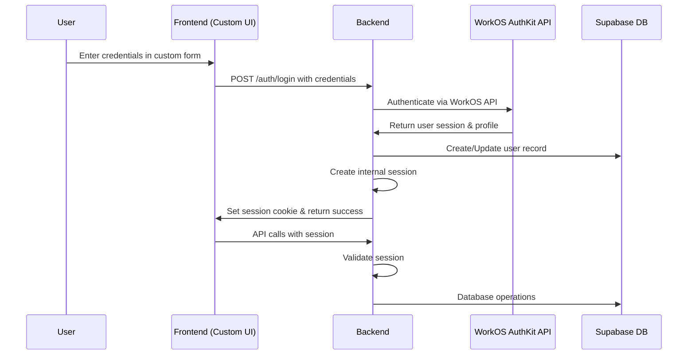

# Design Document

## Overview

This design outlines the migration from Supabase Auth to WorkOS AuthKit while maintaining Supabase as the database backend. We will build our own custom UI components for login/signup while leveraging WorkOS AuthKit's backend authentication services. The architecture will implement server-side session management using WorkOS AuthKit for authentication and Supabase for data storage. The frontend will be completely decoupled from Supabase client libraries and will communicate with the backend through session-based API calls.

## Architecture

### High-Level Flow

1. User interacts with our custom login/signup UI components
2. Frontend sends credentials to our backend API endpoints
3. Backend uses WorkOS AuthKit API to authenticate the user
4. WorkOS returns user session and profile information
5. Backend creates internal session and synchronizes user data with Supabase
6. Frontend receives session cookie and can make authenticated API calls
7. All API routes validate session before processing requests

### Authentication Flow



## Components and Interfaces

### Backend Components

#### 1. WorkOS Integration Service

- **Purpose**: Handle WorkOS authentication flows
- **Responsibilities**:
  - Initialize WorkOS client
  - Handle OAuth callbacks
  - Exchange authorization codes for user profiles
  - Manage WorkOS configuration

#### 2. Session Management Service

- **Purpose**: Manage user sessions server-side
- **Responsibilities**:
  - Create and destroy sessions
  - Validate session tokens
  - Store session data (in-memory or Redis)
  - Handle session expiration

#### 3. User Synchronization Service

- **Purpose**: Sync user data between WorkOS and Supabase
- **Responsibilities**:
  - Create user records in Supabase when new users sign up
  - Update user information when WorkOS profile changes
  - Map WorkOS user IDs to Supabase user records

#### 4. Authentication Middleware (Updated)

- **Purpose**: Protect API routes with session validation
- **Responsibilities**:
  - Validate session cookies on incoming requests
  - Extract user context from sessions
  - Reject unauthorized requests

### Frontend Components

#### 1. Auth Service (Replaces Supabase Auth)

- **Purpose**: Handle authentication state and API communication
- **Responsibilities**:
  - Initiate WorkOS login flow
  - Handle logout requests
  - Manage authentication state
  - Make authenticated API calls

#### 2. Auth Context (Updated)

- **Purpose**: Provide authentication state to React components
- **Responsibilities**:
  - Track user authentication status
  - Provide login/logout functions
  - Handle loading states
  - Manage user profile data

#### 3. Auth Pages

- **Login Page**: Redirect to WorkOS authentication
- **Signup Page**: Redirect to WorkOS registration
- **Dashboard Page**: Display user information
- **Callback Page**: Handle WorkOS redirect after authentication

## Data Models

### Session Model

```typescript
interface Session {
  id: string;
  userId: string;
  workosUserId: string;
  createdAt: Date;
  expiresAt: Date;
  lastAccessedAt: Date;
}
```

### User Model (Updated)

```typescript
interface User {
  id: string; // Supabase UUID
  workos_user_id: string; // WorkOS user ID
  email: string;
  first_name?: string;
  last_name?: string;
  roles: string[];
  is_admin: boolean;
  created_at: Date;
  updated_at: Date;
}
```

### WorkOS User Profile

```typescript
interface WorkOSUser {
  id: string;
  email: string;
  firstName?: string;
  lastName?: string;
  profilePictureUrl?: string;
}
```

## Error Handling

### Authentication Errors

- **Invalid Session**: Return 401 Unauthorized
- **Expired Session**: Return 401 Unauthorized with refresh instruction
- **WorkOS Callback Error**: Redirect to login with error message
- **User Creation Error**: Log error and return 500 Internal Server Error

### Session Management Errors

- **Session Storage Error**: Fallback to stateless JWT tokens
- **Session Cleanup Error**: Log warning but continue operation

### User Synchronization Errors

- **Supabase Connection Error**: Retry with exponential backoff
- **User Creation Conflict**: Update existing user record
- **Missing User Data**: Use WorkOS profile as fallback

## Testing Strategy

### Backend Testing

1. **Unit Tests**:

   - WorkOS service methods
   - Session management functions
   - User synchronization logic
   - Authentication middleware

2. **Integration Tests**:

   - WorkOS OAuth flow (mocked)
   - Session creation and validation
   - User CRUD operations
   - Protected route access

3. **End-to-End Tests**:
   - Complete authentication flow
   - Session persistence across requests
   - User data synchronization

### Frontend Testing

1. **Unit Tests**:

   - Auth service methods
   - Auth context state management
   - Component rendering with auth states

2. **Integration Tests**:

   - Login/logout flows
   - Protected route navigation
   - API call authentication

3. **User Interface Tests**:
   - Login page functionality
   - Dashboard user display
   - Error message handling

## Security Considerations

### Session Security

- Use secure, HTTP-only cookies for session storage
- Implement CSRF protection
- Set appropriate cookie expiration times
- Use secure cookie flags in production

### API Security

- Validate all sessions on every API request
- Implement rate limiting on authentication endpoints
- Log authentication attempts and failures
- Use HTTPS for all authentication flows

### Data Protection

- Never expose WorkOS credentials to frontend
- Encrypt sensitive session data
- Implement proper CORS policies
- Validate and sanitize all user inputs

## Configuration Requirements

### Environment Variables

#### Backend

```
WORKOS_API_KEY=your_workos_api_key
WORKOS_CLIENT_ID=your_workos_client_id
WORKOS_REDIRECT_URI=http://localhost:3001/auth/callback
SESSION_SECRET=your_session_secret
SUPABASE_URL=your_supabase_url
SUPABASE_SERVICE_ROLE_KEY=your_service_role_key
```

#### Frontend

```
VITE_API_BASE_URL=http://localhost:3001
VITE_WORKOS_CLIENT_ID=your_workos_client_id
```

### Dependencies

#### Backend (New)

- `@workos-inc/node`: WorkOS Node.js SDK
- `express-session`: Session management
- `connect-redis` (optional): Redis session store

#### Frontend (Remove)

- `@supabase/supabase-js`: Remove completely

#### Frontend (Keep)

- `axios`: For API communication
- `react-router-dom`: For routing
- All other existing dependencies
